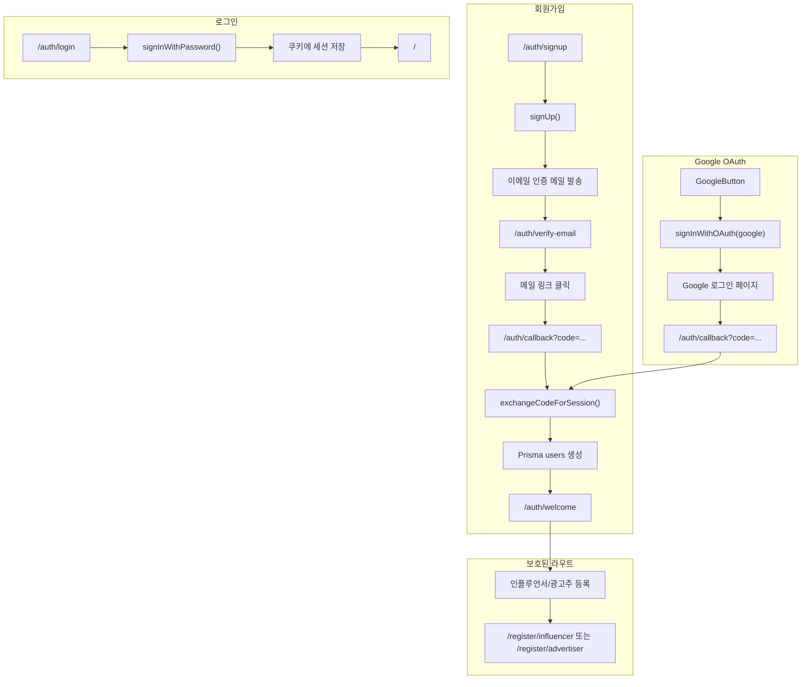

# 인증 개발 가이드

Supabase Auth를 사용한 회원가입/로그인 개발 흐름과, Supabase 대시보드 설정이 우리 코드와 어떻게 연결되는지 정리합니다.

---

## 1. Supabase 대시보드 설정

### 1.1 프로젝트 생성 및 환경변수

1. [Supabase](https://supabase.com)에서 프로젝트 생성
2. **Project Settings → API**에서 다음 값 확인:
   - `Project URL` → `NEXT_PUBLIC_SUPABASE_URL`
   - `anon` `public` 키 → `NEXT_PUBLIC_SUPABASE_ANON_KEY`

3. `apps/web/.env.local`에 설정:

```
NEXT_PUBLIC_SUPABASE_URL=https://xxxx.supabase.co
NEXT_PUBLIC_SUPABASE_ANON_KEY=eyJhbGciOiJIUzI1NiIs...
```

---

### 1.2 Authentication 설정

**Authentication → Providers**에서 사용할 제공자 활성화:

| 제공자 | 용도 | 설정 위치 |
|--------|------|-----------|
| Email | 이메일/비밀번호 로그인 | 기본 활성화 |
| Google | OAuth 로그인 | 추가 설정 필요 |

---

### 1.3 Google OAuth 설정 (선택)

1. **Google Cloud Console**에서 OAuth 클라이언트 생성
   - 사용자 유형: 외부
   - 승인된 리디렉션 URI:  
     `https://<project-ref>.supabase.co/auth/v1/callback`

2. **Supabase Dashboard → Authentication → Providers → Google**에서:
   - Enable 토글 ON
   - Client ID, Client Secret 입력

3. 코드 변경 불필요. `GoogleButton`의 `redirectTo`가 `/auth/callback`으로 설정되어 있어 Google 로그인 후 동일 콜백으로 처리됨.

---

### 1.4 이메일 인증 (Email Confirmation)

**Authentication → Providers → Email**에서:

- **Confirm email**: ON → 가입 시 이메일 인증 필수
- **Secure email change**: ON 권장

이 설정에 따라:

- `signUp()` 호출 시 Supabase가 인증 메일 발송
- 메일 링크 클릭 시 `emailRedirectTo`로 리디렉트 (우리는 `/auth/callback`)
- `Confirm email` OFF면 이메일 인증 없이 바로 로그인됨

---

### 1.5 URL Configuration (리디렉트)

**Authentication → URL Configuration**:

| 항목 | 권장 값 | 설명 |
|------|---------|------|
| Site URL | `http://localhost:3000` (개발) | 기본 리디렉트 대상 |
| Redirect URLs | `http://localhost:3000/auth/callback`, `https://your-domain.com/auth/callback` | 허용 리디렉트 URL (콤마 구분) |

리디렉트 허용 목록에 없는 URL로 보내면 Supabase가 차단합니다.

---

### 1.6 RLS (Row Level Security)

Supabase는 **RLS**로 anon 키로 들어오는 요청에 대한 접근을 제어합니다. 설정하지 않으면 Storage 업로드/다운로드가 거부됩니다.

#### 1.6.1 Storage RLS

우리 앱은 **광고주 사업자등록증**을 `documents` 버킷에 업로드합니다. (`app/register/advertiser/page.tsx` → `supabase.storage.from("documents").upload()`)

1. **Storage → Buckets**에서 `documents` 버킷 생성 (없으면)
2. **documents → Policies**에서 정책 추가:

| 정책 | 작업 | 대상 | SQL |
|------|------|------|-----|
| 업로드 허용 | INSERT | `authenticated` | `bucket_id = 'documents' AND (storage.foldername(name))[1] = 'business-licenses'` |
| 조회 허용 | SELECT | `authenticated` | 위와 동일 |

**적용 방법 (둘 중 하나):**

- **SQL Editor** (권장): Dashboard → **SQL Editor** → New query에 아래 전체 붙여넣고 **Run** 한 번으로 두 정책 모두 적용.
- **Storage Policies UI**: Storage → documents → Policies → **New Policy** → For full customization. 정책은 한 번에 하나만 추가되므로, **INSERT 정책(첫 번째 블록) 적용 후, 다시 New Policy로 SELECT 정책(두 번째 블록)** 적용. → 두 번 해야 함.

```sql
-- 업로드: 로그인한 사용자가 business-licenses 폴더에 업로드 가능
CREATE POLICY "Users can upload own business license"
ON storage.objects FOR INSERT
TO authenticated
WITH CHECK (
  bucket_id = 'documents'
  AND (storage.foldername(name))[1] = 'business-licenses'
);

-- 조회: 로그인한 사용자가 business-licenses 폴더 파일 조회 가능
CREATE POLICY "Users can read own business license"
ON storage.objects FOR SELECT
TO authenticated
USING (
  bucket_id = 'documents'
  AND (storage.foldername(name))[1] = 'business-licenses'
);
```

> 사업자등록증은 민감 문서이므로 `documents` 버킷은 **Private**으로 두고, 필요 시 `createSignedUrl()`로 임시 URL 생성하는 방식을 권장합니다.

#### 1.6.2 Database RLS

이 프로젝트는 **Prisma**로 DB 접근(`DATABASE_URL` 직접 연결)하므로, Supabase PostgREST API를 통한 테이블 조회는 하지 않습니다. 따라서 **Database RLS는 현재 Auth/회원가입 흐름에 필수는 아닙니다**.

다만 Supabase 프로젝트를 쓰면 public 스키마에 RLS가 기본 적용될 수 있습니다. Prisma 연결에 사용하는 role이 RLS를 우회(예: `postgres` superuser)한다면 영향이 없고, 나중에 Supabase Realtime/PostgREST로 직접 테이블을 조회할 계획이 있다면 그때 RLS 정책을 정의해야 합니다.

---

## 2. 환경변수와 코드 연결

### 2.1 사용하는 환경변수

| 변수 | 사용처 | 용도 |
|------|--------|------|
| `NEXT_PUBLIC_SUPABASE_URL` | `lib/supabase/client.ts`, `server.ts`, `middleware.ts` | Supabase 프로젝트 URL |
| `NEXT_PUBLIC_SUPABASE_ANON_KEY` | 위 동일 | 공개 API 키 (클라이언트/서버 공용) |

> `NEXT_PUBLIC_` 접두사로 클라이언트 번들에 포함됩니다. `anon` 키는 RLS로 보호되는 공개 키입니다.

---

### 2.2 Supabase 클라이언트 3종

| 파일 | 용도 | 사용 위치 |
|------|------|-----------|
| `lib/supabase/client.ts` | 브라우저용 (클라이언트 컴포넌트) | 로그인 폼, Navbar, 회원가입 폼 등 |
| `lib/supabase/server.ts` | 서버용 (Server Component, Route Handler, Server Action) | 콜백, welcome 페이지, 회원가입 완료 등 |
| `lib/supabase/middleware.ts` | 미들웨어 (매 요청) | 세션 갱신, 라우트 보호 |

**클라이언트 vs 서버**

- 클라이언트: `createBrowserClient` — 쿠키 자동 처리
- 서버: `createServerClient` + `cookies()` — Next.js 쿠키 스토어 사용
- 미들웨어: `createServerClient` + `request.cookies` — 요청 단계에서 세션 갱신

---

## 3. 인증 흐름과 코드 매핑

### 3.1 전체 흐름도



---

### 3.2 회원가입 (이메일)

| 단계 | Supabase 설정 | 코드 위치 |
|------|---------------|-----------|
| 1. 가입 폼 제출 | Email provider 활성화 | `components/auth/signup-form.tsx` → `signUp({ email, password, options: { emailRedirectTo } })` |
| 2. 인증 메일 대기 | Confirm email ON | `app/auth/verify-email/page.tsx` — `onAuthStateChange`로 SIGNED_IN 감지 |
| 3. 메일 링크 클릭 | Redirect URLs에 `/auth/callback` 등록 | `app/auth/callback/route.ts` → `exchangeCodeForSession(code)` |
| 4. DB 유저 생성 | (우리 DB) | 콜백에서 `prisma.user.create` (없을 때만) |
| 5. 온보딩 여부에 따른 리디렉트 | (우리 로직) | `isOnboarded` false → `/auth/welcome` |

---

### 3.3 로그인 (이메일/비밀번호)

| 단계 | 코드 위치 |
|------|-----------|
| 폼 제출 | `components/auth/login-form.tsx` → `signInWithPassword({ email, password })` |
| 세션 저장 | Supabase가 쿠키에 자동 저장 |
| 리디렉트 | 성공 시 `router.push("/")`, `router.refresh()` |

---

### 3.4 Google OAuth

| 단계 | Supabase 설정 | 코드 위치 |
|------|---------------|-----------|
| 1. 버튼 클릭 | Google provider 활성화 | `components/auth/google-button.tsx` → `signInWithOAuth({ provider: "google", options: { redirectTo } })` |
| 2. Google 로그인 | OAuth Client ID/Secret | Supabase가 처리 |
| 3. 콜백 | Redirect URLs | `app/auth/callback/route.ts` — 이메일 로그인과 동일 흐름 |

---

### 3.5 비밀번호 재설정

| 단계 | Supabase 설정 | 코드 위치 |
|------|---------------|-----------|
| 1. 이메일 입력 | Email provider | `components/auth/reset-password-form.tsx` → `resetPasswordForEmail({ redirectTo: ".../auth/callback?next=/auth/update-password" })` |
| 2. 메일 링크 클릭 | Redirect URLs | Supabase가 재설정 토큰 포함 URL로 리디렉트 |
| 3. 새 비밀번호 설정 | - | `components/auth/update-password-form.tsx` → `updateUser({ password })` |

> `redirectTo`의 `next` 쿼리는 현재 미사용. Supabase가 비밀번호 재설정 링크로 보내는 URL에 `#access_token` 등이 포함되며, 이 경우 `/auth/update-password`가 별도로 필요할 수 있음.

---

## 4. 라우트 보호

### 4.1 미들웨어 동작

`middleware.ts` → `lib/supabase/middleware.ts`의 `updateSession()`:

1. 매 요청마다 Supabase 세션 갱신 (쿠키 갱신)
2. `getUser()`로 로그인 여부 확인
3. 라우트별 리디렉트 처리

---

### 4.2 보호되는 경로

| 경로 패턴 | 비로그인 시 | 로그인 시 |
|-----------|-------------|-----------|
| `/register/*`, `/auth/welcome`, `/mypage` | `/auth/login`으로 리디렉트 | 접근 가능 |
| `/auth/login`, `/auth/signup` | 접근 가능 | `/`로 리디렉트 |

**코드:** `lib/supabase/middleware.ts`의 `protectedPaths`, `authOnlyPaths`

---

### 4.3 경로 추가/변경

`lib/supabase/middleware.ts` 수정:

```typescript
const protectedPaths = ["/register", "/auth/welcome", "/mypage", "/your-new-path"]
const authOnlyPaths = ["/auth/login", "/auth/signup"]
```

---

## 5. User 테이블과 Supabase Auth 연결

### 5.1 관계

- **Supabase `auth.users`**: 이메일, 비밀번호, OAuth 메타데이터 등
- **Prisma `users`**: `id` = `auth.users.id`, 온보딩, 유저 타입 등

`auth.users.id`를 그대로 `users.id`로 사용합니다.

---

### 5.2 User 생성 시점

`app/auth/callback/route.ts`:

```typescript
// exchangeCodeForSession 후
let dbUser = await prisma.user.findUnique({ where: { id: user.id } })
if (!dbUser) {
  dbUser = await prisma.user.create({
    data: { id: user.id, email: user.email, isOnboarded: false },
  })
}
```

- 이메일 가입: 이메일 인증 후 콜백에서 생성
- Google OAuth: 첫 로그인 시 콜백에서 생성

---

### 5.3 온보딩 플로우

| 상태 | 흐름 |
|------|------|
| `isOnboarded: false` | `/auth/welcome` → 인플루언서/광고주 선택 |
| 인플루언서/광고주 등록 완료 | Server Action에서 `isOnboarded: true`로 업데이트 |
| "나중에 할게요" | welcome 페이지의 SkipOnboardingButton에서 `isOnboarded: true`로 업데이트 |

---

## 6. UI에서 유저 상태 사용

### 6.1 클라이언트 (Navbar 등)

```typescript
// lib/supabase/client.ts 사용
const supabase = createClient()
const { data: { user } } = await supabase.auth.getUser()

// 실시간 변경 감지
supabase.auth.onAuthStateChange((_event, session) => {
  setUser(session?.user ?? null)
})
```

**위치:** `components/navbar.tsx` — 로그인/로그아웃 버튼 표시

---

### 6.2 서버 (페이지, Server Action)

```typescript
// lib/supabase/server.ts 사용
const supabase = await createClient()
const { data: { user } } = await supabase.auth.getUser()
if (!user) redirect("/auth/login")
```

**위치:** `app/auth/welcome/page.tsx`, `app/register/*/actions.ts` 등

---

## 7. 개발 시 체크리스트

| 확인 항목 | Supabase | 코드 |
|-----------|----------|------|
| 이메일 로그인 | Email provider ON | `login-form.tsx`, `signup-form.tsx` |
| 이메일 인증 | Confirm email ON/OFF | `verify-email/page.tsx` |
| Google 로그인 | Google provider + Client ID/Secret | `google-button.tsx` |
| 리디렉트 | Redirect URLs에 `/auth/callback` 등록 | `signup-form`, `google-button`, `reset-password-form` |
| 비밀번호 재설정 | Email provider | `reset-password-form`, `update-password-form` |
| **RLS (Storage)** | `documents` 버킷에 INSERT/SELECT 정책 | 광고주 사업자등록증 업로드 (`register/advertiser/page.tsx`) |
| 보호 경로 | - | `lib/supabase/middleware.ts` |
| User 동기화 | - | `app/auth/callback/route.ts` |

---

## 8. 관련 파일 요약

| 경로 | 역할 |
|------|------|
| `lib/supabase/client.ts` | 브라우저용 Supabase 클라이언트 |
| `lib/supabase/server.ts` | 서버용 Supabase 클라이언트 |
| `lib/supabase/middleware.ts` | 세션 갱신, 라우트 보호 |
| `middleware.ts` | 미들웨어 진입점 |
| `app/auth/callback/route.ts` | OAuth/이메일 인증 콜백, User 생성 |
| `app/auth/login/page.tsx` | 로그인 페이지 |
| `app/auth/signup/page.tsx` | 회원가입 페이지 |
| `app/auth/verify-email/page.tsx` | 이메일 인증 대기 |
| `app/auth/welcome/page.tsx` | 온보딩 유형 선택 |
| `app/auth/reset-password/page.tsx` | 비밀번호 재설정 요청 |
| `app/auth/update-password/page.tsx` | 새 비밀번호 설정 |
| `components/auth/login-form.tsx` | 로그인 폼 |
| `components/auth/signup-form.tsx` | 회원가입 폼 |
| `components/auth/google-button.tsx` | Google 로그인 버튼 |
| `components/auth/reset-password-form.tsx` | 비밀번호 재설정 폼 |
| `components/auth/update-password-form.tsx` | 비밀번호 변경 폼 |
| `components/navbar.tsx` | 로그인 상태에 따른 UI |
